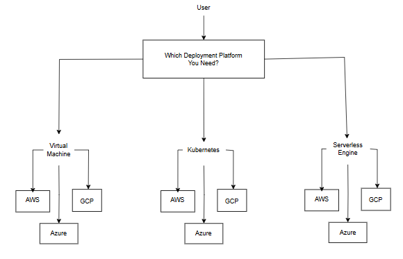

**User-Choice-Platform-Tasks**

This repository provides a modular Terraform setup that allows users to deploy Virtual Machines, Kubernetes Clusters, and Serverless Engines on AWS, Azure, and GCP. The user can specify the desired deployment platform (VM, Kubernetes, or Serverless Engine) and cloud provider (AWS, Azure, GCP) through the variables.tf file, and Terraform will automatically provision the respective resources on the selected cloud platform.

## Table of Contents
- [Deployment Example](#deployment-example)

- [Project Structure](#project-structure)

**Pre-Requisites**
- Create an Azure Blob Storage account and upload your Google Credential file. Copy the URL of the file along with its SAS token.
- Set up an Azure Key Vault to store your secrets or credential values, including the Blob storage URL containing the Google Credential file.
- Update the names of the Key Vault and Key Vault secrets in the terraform.tfvars file.


## Deployment Example Image

<div align="center">
  
</div>

## Deployment Steps

1. az login 
2. Fill that terraform.tfvars file values.
3. Terraform init
4. Terraform apply --auto-approve -var-file = "terraform.tfvars"

## Project Structure

```plaintext

User-Choice-Platform-Tasks
├── Virtual-Machines
│   ├── AWS-VM
│   │   ├── AWS-VM.tf
│   │   └── AWS-VM-Variables.tf
│   ├── Azure-VM
│   │   ├── Azure-VM.tf
│   │   └── Azure-VM-Variables.tf
│   ├── GCP-VM
│   │   ├── GCP-VM.tf
│   │   └── GCP-VM-Variables.tf
│   ├── vm-main.tf
│   └── vm-variables.tf
│
├── Kubernetes-Cluster
│   ├── AWS-Cluster
│   │   ├── AWS-Cluster.tf
│   │   └── AWS-Cluster-Variables.tf
│   ├── Azure-Cluster
│   │   ├── Azure-Cluster.tf
│   │   └── Azure-Cluster-Variables.tf
│   ├── GCP-Cluster
│   │   ├── GCP-Cluster.tf
│   │   └── GCP-Cluster-Variables.tf
│   ├── kubernetes-main.tf
│   └── kubernetes-variables.tf
│
├── Serverless-Engine
│   ├── AWS-Engine
│   │   ├── AWS-Engine.tf
│   │   └── AWS-Engine-Variables.tf
│   ├── Azure-Engine
│   │   ├── Azure-Engine.tf
│   │   └── Azure-Engine-Variables.tf
│   ├── GCP-Engine
│   │   ├── GCP-Engine.tf
│   │   └── GCP-Engine-Variables.tf
│   ├── Engine-main.tf
│   └── Engine-variables.tf
│
├── provider.tf
├── main.tf
├── values.tfvars
└── variables.tf